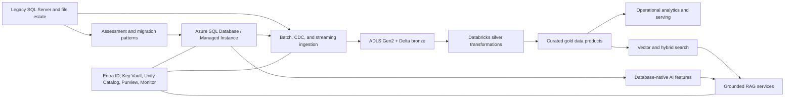

# Enterprise Azure Data and AI Modernisation Platform

This repository is the foundation for an enterprise Azure Data and AI modernisation reference implementation that modernises a legacy operational data estate into a secure platform.

The scenario is a fictional international logistics company, Contoso Freight, moving from fragmented SQL Server workloads and spreadsheet-driven analytics toward a governed platform spanning Azure SQL, Azure Databricks, ADLS Gen2, Microsoft Entra ID, Key Vault, observability, CI/CD, and AI-enabled data products.

Milestone 1 establishes the repository structure, architectural intent, engineering standards, and decision records. Milestone 2 adds a deterministic synthetic legacy source estate for future assessment, migration, ingestion, governance, performance, and AI work. Milestone 3 adds estate assessment and modernisation decisioning. Milestone 4 adds target-state architecture and platform decisions. Milestone 5 adds a local migration factory for schema, data, validation, cutover, rollback, and evidence generation. The repository still does not deploy Azure resources, does not implement production data pipelines, and does not claim working AI workloads.

## Business Problem

Contoso Freight runs shipment booking, depot operations, fleet maintenance, customer service, and disruption management on a mixed estate of legacy SQL Server databases, file drops, and manual reporting. Teams need faster operational insight, governed analytical data, reliable migration paths for relational workloads, and controlled AI capabilities that can search and reason over enterprise data without bypassing security controls.

## Target Solution

The planned platform provides:

- Azure SQL modernisation patterns for operational databases, including Azure SQL Database, Azure SQL Managed Instance, and SQL Server on Azure VM trade-offs.
- Azure Databricks engineering for batch, CDC, and streaming ingestion into a medallion lakehouse on ADLS Gen2 and Delta Lake.
- Unity Catalog, Microsoft Purview integration points, lineage, data quality gates, and access controls.
- Azure SQL native AI capabilities where they belong close to operational data, plus external vector, hybrid search, and RAG components where broader retrieval or orchestration is required.
- Managed identity, Microsoft Entra-first authentication, Key Vault, least privilege RBAC, encryption, row-level security, masking, and auditing.
- Infrastructure as Code, CI/CD, validation, monitoring, FinOps, and operational runbooks.

## High-Level Architecture



## Current Implementation

Milestone 1 includes:

- Professional repository structure for infrastructure, SQL, Databricks, data engineering, AI, governance, observability, CI/CD, tests, documentation, synthetic data planning, and runbooks.
- Architecture documentation, system boundaries, principles, data-flow model, environment strategy, and HA/DR guidance.
- ADR scaffolding and initial architecture decisions.
- Bicep-first infrastructure skeleton with environment parameter placeholders.
- Deterministic repository and documentation validation.
- GitHub Actions CI foundation for local-equivalent validation.

Milestone 2 includes:

- A coherent synthetic Contoso Freight legacy estate covering customer/account management, freight orders, depots/routes, vehicles, billing/payments, and customer-service cases.
- SQL Server-style OLTP source scripts with tables, constraints, indexes, views, stored procedures, seed reference data, teardown, and representative workload queries.
- A PostgreSQL-like secondary billing and customer-service source schema.
- Deterministic synthetic-data generation with `tiny`, `development`, and `performance` profiles.
- Committed tiny sample fixtures plus ignored local generation paths for larger datasets.
- CSV, JSON, and JSONL feed/event fixtures with intentional, documented data-quality defects.
- Machine-readable contracts for file feeds, operational events, and core identifiers.
- A deterministic workload simulator for OLTP, operational reporting, analytical candidates, and CDC/event-source candidates.

Milestone 3 includes:

- Machine-readable estate inventory with explicit evidence classifications.
- Dependency model across applications, databases, stored procedures, file feeds, billing/service systems, reporting, events, identity, and scheduling.
- Local static compatibility assessment for SQL Server-style assets.
- Workload classification from the deterministic simulator.
- Azure target-service decisions with selected targets, rejected alternatives, and modernisation disposition.
- Configurable migration complexity scoring, migration wave planning, risk register, generated CSV outputs, and assessment report.

Milestone 4 includes:

- Target architecture across operational data, analytical/data-engineering, future AI-enabled data, and control/security/operations planes.
- Formal workload-to-target matrix, component catalog, security-control matrix, recovery strategy matrix, environment matrix, assumption register, and architecture traceability.
- Design decisions for Azure SQL Managed Instance, PostgreSQL Flexible Server, Databricks, ADLS Gen2, Delta Lake, Unity Catalog, private networking, identity, data protection, HA/DR, and environment isolation.
- Architecture report and validation command for deterministic target-state outputs.

Milestone 5 includes:

- Migration manifests for `legacy_tms` and `billing_ops`.
- Target-ready Azure SQL Managed Instance and PostgreSQL Flexible Server schema assets.
- Compatibility remediation register mapped to assessment findings.
- Local deterministic migration execution from synthetic source fixtures to target-shaped CSV outputs.
- Reconciliation checks, validation gates, migration wave execution evidence, cutover readiness, rollback readiness, failure scenarios, tooling integration boundaries, and hypercare model.

## Planned Roadmap

Future milestones will add real Azure migration execution, Azure SQL administration, SQL performance engineering, SQL CI/CD, Databricks platform implementation, Databricks pipelines, governance automation, data quality implementation, operational analytics, AI-enabled SQL/search/RAG, API integration, monitoring, FinOps, and production assurance. The full milestone roadmap is maintained in [docs/roadmap.md](docs/roadmap.md).

## Architecture Decisions and Trade-Offs

This platform deliberately separates workload responsibilities:

- Azure SQL remains the system of record for operational relational workloads where transactional consistency, security, and SQL performance engineering matter most.
- Databricks owns scalable lakehouse engineering, data quality, transformation, and analytical processing.
- Database-native AI is used for close-to-data capabilities, while external AI/search services handle cross-domain retrieval, orchestration, and grounded assistant patterns.
- Managed identity and Entra-first authentication are preferred to reduce secret sprawl and support auditable least privilege.
- Bicep is the default IaC language for Azure-native resources because it keeps Azure resource modelling explicit and reviewable.

## Repository Map

| Path | Purpose |
| --- | --- |
| `infra/` | Bicep infrastructure modules, environment parameter placeholders, deployment scripts |
| `src/azure_sql/` | Future SQL schema, migration, performance, and operational automation assets |
| `src/databricks/` | Future Databricks jobs, Lakeflow, notebooks, and Unity Catalog assets |
| `src/data_engineering/` | Secondary source schemas plus future ingestion, CDC, streaming, modelling, and data-quality code |
| `src/ai/` | Future SQL AI, embeddings, search, and RAG components |
| `src/security_governance/` | Future RBAC, policies, lineage, masking, and audit automation |
| `src/observability/` | Future monitoring, SLO, logging, and FinOps assets |
| `docs/` | Architecture, roadmap, ADRs, runbooks, and operating model |
| `data/` | Synthetic data strategy, source contracts, sample fixtures, and ignored local generated data zones |
| `outputs/` | Generated estate-assessment CSV outputs |
| `reports/` | Generated assessment and target architecture reports |
| `tests/` | Deterministic validation for repository foundation and synthetic legacy estate |

## Local Validation

```bash
python3 -m pip install -e ".[dev]"
make validate
```

The validation checks required directories, key documentation, ADR metadata, and internal Markdown links.

Generate the default local development estate with:

```bash
make generate-estate
make generate-workload
```

Generated development outputs are written under `data/raw/legacy_estate/` and are intentionally ignored by git.

Generate the estate assessment outputs with:

```bash
make assess-estate
```

Generate and validate the target architecture outputs with:

```bash
make validate-architecture
```

Run the local migration factory with:

```bash
make migrate-local
make validate-migration
```
