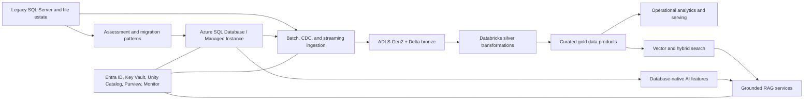

# Enterprise Azure Data and AI Modernisation Platform

This repository implements an enterprise Azure Data and AI modernisation reference platform that modernises a legacy operational data estate into a secure, governed platform.

The scenario is a fictional international logistics company, Contoso Freight, moving from fragmented SQL Server workloads and spreadsheet-driven analytics toward a governed platform spanning Azure SQL, Azure Databricks, ADLS Gen2, Microsoft Entra ID, Key Vault, observability, CI/CD, and AI-enabled data products.

## Implementation Milestones

### Milestone 1 — Enterprise Platform Foundation
Established the repository structure, architectural intent, engineering standards, decision records, Bicep-first infrastructure foundations, validation framework, and CI baseline for the Contoso Freight modernisation programme.

### Milestone 2 — Synthetic Legacy Data Estate
Created a deterministic synthetic legacy estate spanning SQL Server-style operational workloads, PostgreSQL-like billing and service data, file feeds, event streams, contracts, workload simulation, and documented data-quality defects.

### Milestone 3 — Estate Assessment and Modernisation Decisioning
Implemented current-state inventory, dependency mapping, workload classification, compatibility assessment, Azure target recommendations, migration complexity scoring, migration waves, risks, and evidence-backed modernisation decisions.

### Milestone 4 — Target-State Architecture
Defined the target architecture across operational data, analytical engineering, AI-enabled data, and control/security/operations planes, including workload-to-service mapping, networking, identity, security, HA/DR, environment strategy, and architecture traceability.

### Milestone 5 — Migration Factory
Built a deterministic migration factory for SQL Server and PostgreSQL workloads with migration manifests, target schemas, compatibility remediation, reconciliation, cutover, rollback, hypercare, readiness gates, and migration evidence.

### Milestone 6 — Azure SQL Administration and Operations
Implemented the Azure SQL Managed Instance operational model with Entra-first access, managed identity, Key Vault integration, masking, RLS patterns, auditing, monitoring, alerts, SQL Agent jobs, backup/restore readiness, HA/DR guidance, and operational runbooks.

### Milestone 7 — SQL Performance Engineering
Added workload baselines, Query Store and DMV diagnostics, execution-plan analysis, indexing and statistics strategy, blocking/deadlock investigation, parameter-sensitive query handling, regression controls, and performance assurance evidence.

### Milestone 8 — SQL Database Development Lifecycle and CI/CD
Implemented an SDK-style SQL Database Project with database-as-code, declarative schema objects, reference-data deployment, static SQL tests, DACPAC build automation, release evidence, schema-drift controls, security and performance gates, and GitHub Actions CI/CD guardrails.

### Milestone 9 — Databricks Platform and Unity Catalog Foundation
Established the Databricks platform foundation with dev/test/prod environment design, compute strategy, Unity Catalog hierarchy, managed-identity storage access, least-privilege permissions, governance tags, row/column security patterns, lineage, sharing boundaries, and Databricks Asset Bundle structure.

### Milestone 10 — Databricks Ingestion and Medallion Processing
Implemented ingestion patterns for relational, file, and event sources; Bronze/Silver/Gold processing; Auto Loader; Structured Streaming; CDC and incremental loads; replay and idempotency; schema drift handling; quarantine; SCD Type 2; dimensional modelling; and governed Gold data products.

### Milestone 11 — Data Quality and Lakeflow Orchestration
Added formal data-quality rules, severity and remediation handling, quarantine and replay controls, freshness checks, publication gates, Lakeflow Jobs orchestration, task dependencies, retries, schedules, parameters, permissions, and operational runbooks.

### Milestone 12 — Databricks Operations, Performance and FinOps
Implemented monitoring across jobs, compute, SQL warehouses, streaming, Delta tables, Unity Catalog, data quality, audit, and cost; added system-table diagnostics, Spark troubleshooting, Delta health, streaming recovery, compute policy, SLOs, operational alerts, and FinOps controls.

### Milestone 13 — AI-Enabled SQL, Vector Search and RAG
Implemented AI-ready SQL assets for document chunking, embeddings, vector search, full-text search, hybrid retrieval, RRF ranking, SQL-native RAG context assembly, retrieval evaluation, audit, security, failure handling, cost controls, and Azure OpenAI integration boundaries.

### Milestone 14 — Secure Application and API Integration
Added secure application integration using Data API Builder, REST, GraphQL, stored-procedure boundaries, Entra authentication, managed identity, authorization roles, sensitive-field controls, MCP tool contracts, Container Apps hosting architecture, resilience, rate limiting, observability, and audit traceability.

### Milestone 15 — Microsoft Fabric Downstream Integration Boundary
Defined the governed handoff from Azure and Databricks Gold products into Microsoft Fabric, including ownership boundaries, OneLake shortcut and Delta interoperability patterns, contracts, schema compatibility, publication gates, freshness, sensitivity, lineage, quality, failure responsibility, and duplication controls.

### Milestone 16 — Final Cross-Platform Assurance and Portfolio Release
Completed repository-wide assurance across architecture, security, identity, governance, resilience, observability, FinOps, AI, APIs, CI/CD, data products, ownership, failure modes, production gaps, risks, runbooks, implementation truth, release readiness, and deterministic final release evidence.

## Business Problem

Contoso Freight runs shipment booking, depot operations, fleet maintenance, customer service, and disruption management on a mixed estate of legacy SQL Server databases, file drops, and manual reporting. Teams need faster operational insight, governed analytical data, reliable migration paths for relational workloads, and controlled AI capabilities that can search and reason over enterprise data without bypassing security controls.

## Target Solution

The platform demonstrates:

- Azure SQL modernisation patterns for operational databases, including Azure SQL Database, Azure SQL Managed Instance, and SQL Server on Azure VM trade-offs.
- Azure Databricks engineering for batch, CDC, and streaming ingestion into a medallion lakehouse on ADLS Gen2 and Delta Lake.
- Unity Catalog, Microsoft Purview integration points, lineage, data quality gates, and access controls.
- Azure SQL native AI capabilities where they belong close to operational data, plus external vector, hybrid search, and RAG components where broader retrieval or orchestration is required.
- Managed identity, Microsoft Entra-first authentication, Key Vault, least privilege RBAC, encryption, row-level security, masking, and auditing.
- Infrastructure as Code, CI/CD, validation, monitoring, FinOps, and operational runbooks.

## High-Level Architecture



## Current Implementation

Milestone 1 includes:

- Professional repository structure for infrastructure, SQL, Databricks, data engineering, AI, governance, observability, CI/CD, tests, documentation, synthetic data planning, and runbooks.
- Architecture documentation, system boundaries, principles, data-flow model, environment strategy, and HA/DR guidance.
- ADR scaffolding and initial architecture decisions.
- Bicep-first infrastructure skeleton with environment parameter placeholders.
- Deterministic repository and documentation validation.
- GitHub Actions CI foundation for local-equivalent validation.

Milestone 2 includes:

- A coherent synthetic Contoso Freight legacy estate covering customer/account management, freight orders, depots/routes, vehicles, billing/payments, and customer-service cases.
- SQL Server-style OLTP source scripts with tables, constraints, indexes, views, stored procedures, seed reference data, teardown, and representative workload queries.
- A PostgreSQL-like secondary billing and customer-service source schema.
- Deterministic synthetic-data generation with `tiny`, `development`, and `performance` profiles.
- Committed tiny sample fixtures plus ignored local generation paths for larger datasets.
- CSV, JSON, and JSONL feed/event fixtures with intentional, documented data-quality defects.
- Machine-readable contracts for file feeds, operational events, and core identifiers.
- A deterministic workload simulator for OLTP, operational reporting, analytical candidates, and CDC/event-source candidates.

Milestone 3 includes:

- Machine-readable estate inventory with explicit evidence classifications.
- Dependency model across applications, databases, stored procedures, file feeds, billing/service systems, reporting, events, identity, and scheduling.
- Local static compatibility assessment for SQL Server-style assets.
- Workload classification from the deterministic simulator.
- Azure target-service decisions with selected targets, rejected alternatives, and modernisation disposition.
- Configurable migration complexity scoring, migration wave planning, risk register, generated CSV outputs, and assessment report.

Milestone 4 includes:

- Target architecture across operational data, analytical/data-engineering, future AI-enabled data, and control/security/operations planes.
- Formal workload-to-target matrix, component catalog, security-control matrix, recovery strategy matrix, environment matrix, assumption register, and architecture traceability.
- Design decisions for Azure SQL Managed Instance, PostgreSQL Flexible Server, Databricks, ADLS Gen2, Delta Lake, Unity Catalog, private networking, identity, data protection, HA/DR, and environment isolation.
- Architecture report and validation command for deterministic target-state outputs.

Milestone 5 includes:

- Migration manifests for `legacy_tms` and `billing_ops`.
- Target-ready Azure SQL Managed Instance and PostgreSQL Flexible Server schema assets.
- Compatibility remediation register mapped to assessment findings.
- Local deterministic migration execution from synthetic source fixtures to target-shaped CSV outputs.
- Reconciliation checks, validation gates, migration wave execution evidence, cutover readiness, rollback readiness, failure scenarios, tooling integration boundaries, and hypercare model.

Milestone 6 includes:

- Azure SQL Managed Instance operational configuration baseline for `legacy_tms`.
- Bicep module intent for SQL MI, managed identity, Key Vault, diagnostics, Log Analytics, and alerting.
- Entra-first T-SQL security roles, placeholder principals, grants, masking, classification, and RLS pattern.
- KQL investigation assets, alert catalog, SQL Agent job definitions, backup/restore readiness, HA/DR readiness, operational readiness evidence, and runbooks.

Milestone 7 includes:

- SQL performance workload catalog and deterministic baseline model.
- Query Store configuration/diagnostic scripts, DMV toolkit, execution-plan analysis model, index recommendations, statistics strategy, blocking/deadlock scenarios, parameter-sensitive query scenario, regression workflow, and performance assurance evidence.

Milestone 8 includes:

- SDK-style SQL Database Project for the `legacy_tms` Azure SQL Managed Instance target using `Microsoft.Build.Sql`.
- Declarative table, view, procedure, security, pre-deployment, post-deployment reference-data, and static test assets.
- Dacpac build command that uses real local tooling when available and fails clearly when `dotnet` is absent.
- Deterministic SQL release evidence for inventory, traceability, reference data, safety rules, drift scenarios, environment promotion, tests, performance gates, security gates, readiness, and release manifest.
- GitHub Actions CI/CD guardrails for validation, dacpac build, artifact upload, release preview, environment approval, and explicit no-secret/no-fake-publish boundaries.

Milestone 9 includes:

- Azure Databricks dev/test/prod workspace and environment architecture.
- Switch-gated Bicep foundation for workspace, ADLS Gen2, access connector, containers, diagnostics, and managed-identity boundaries.
- Compute strategy for interactive, jobs, serverless jobs, SQL warehouse, future pipeline, and exception-only classic compute.
- Unity Catalog namespace design with environment catalogs and bronze, silver, gold, reference, quarantine, and audit schemas.
- Target-ready Unity Catalog SQL assets for representative shipment, customer, depot/route, billing/service, operational event, quarantine, audit, view, function, and governance objects.
- Least-privilege access model, governed tags, row/column security patterns, retention strategy, lineage/audit readiness, Delta Sharing and federation boundaries, and Databricks Asset Bundle foundation.

Milestone 10 includes:

- Source ingestion patterns for `legacy_tms`, `billing_ops`, depot reference feeds, carrier updates, customer service exports, and shipment operational events.
- Bronze, Silver, and Gold medallion design with Databricks-ready Spark/PySpark/SQL assets and deterministic local transformation functions.
- Auto Loader, Structured Streaming, incremental/CDC, checkpoint, replay, idempotency, schema drift, and quarantine design.
- Analytical data model with dimensions, facts, physical layout strategy, and SCD Type 2 customer dimension logic.
- Data contracts and generated evidence for ingestion, Bronze/Silver/Gold catalogs, model, SCD, drift, checkpoints, quarantine, replay, layout, traceability, and readiness.

Milestone 11 includes:

- Formal data-quality rules by Bronze, Silver, and Gold layer with severity/action mappings.
- Deterministic quality evidence, quarantine catalog, replay/remediation model, freshness assumptions, and publication gate behavior.
- Lakeflow Jobs bundle resources for batch feeds, relational increments, event streaming, Gold publication, and controlled backfill/replay.
- Task dependencies, parameters, schedules, retry/timeout policy, failure handling, permissions, traceability, and operational runbooks.

Milestone 12 includes:

- Databricks monitoring architecture across Lakeflow Jobs, tasks, compute, serverless, SQL warehouses, Structured Streaming, Delta tables, Unity Catalog, quality gates, storage, audit/security, and cost.
- Databricks-ready system-table SQL query assets for jobs, compute, query history, audit, lineage, warehouse latency, and cost attribution.
- Spark troubleshooting, join optimization, Delta table health, retention/VACUUM safety, predictive optimization assessment, streaming health/recovery, compute policy, SQL warehouse operations, FinOps, alerts, SLO assumptions, and runbooks.

Milestone 13 includes:

- AI-ready SQL schema assets for `ai.Document`, `ai.DocumentChunk`, `ai.EmbeddingMetadata`, `ai.RetrievalAudit`, and `ai.GenerationAudit` integrated into the SQL database project.
- Target-ready SQL examples for `AI_GENERATE_CHUNKS`, `AI_GENERATE_EMBEDDINGS`, `CREATE EXTERNAL MODEL`, `VECTOR(1536)`, `VECTOR_DISTANCE`, `VECTOR_SEARCH`, full-text search, RRF hybrid ranking, JSON context assembly, and outbound Azure OpenAI invocation.
- Deterministic local evidence for chunking, source traceability, stale detection, metadata filters, retrieval fixtures, Precision@K, Recall@K, MRR, context contracts, security, audit, failure handling, and cost controls.
- SQL AI architecture documentation, environment placeholders with no secrets, runbooks, and CI/CD guardrails for external model, vector dimension/index, endpoint, AI role, and retrieval-security changes.

Milestone 14 includes:

- Allowlisted application/API use cases for shipment lookup, operational reference lookup, sanitized service-case retrieval, governed AI retrieval/RAG execution, and grounding source metadata.
- Production-style Data API Builder configuration with Entra authentication, explicit roles, REST routes, selected GraphQL read entities, field restrictions, and no anonymous production permissions.
- Target-ready SQL API views, stored-procedure boundaries, API roles/permissions, OpenAPI and GraphQL examples, MCP-compatible read-focused tool contracts, KQL observability queries, and Container Apps Bicep module.
- Deterministic evidence for API catalog, DAB entities, authorization, sensitive exposure, AI endpoint contract, MCP security, hosting, resilience, errors, rate limits, observability, audit traceability, security scenarios, and readiness.

Milestone 15 includes:

- Explicit Azure/Fabric/shared ownership boundary for producer and downstream consumer responsibilities.
- Fabric-facing Gold product catalog for shipment operations performance, depot/route performance, delivery delay metrics, billing/revenue summary, and service/incident summary.
- Integration pattern decisions favoring governed Delta/ADLS publication plus OneLake shortcut/interoperability where validated, with controlled copy only by exception.
- Contract-first schema, versioning, publication gate, freshness, identity/access, sensitivity, lineage, quality manifest, failure ownership, and cost/duplication evidence.

Milestone 16 includes:

- Final capability inventory, architecture traceability, service ownership, security/identity assurance, governance/data-product assurance, resilience/failure-mode assurance, observability, FinOps, AI/API assurance, CI/CD assurance, implementation truth matrix, production gap register, final risk register, runbook catalog, release readiness, and release manifest.
- Repository-wide no-secret check, deterministic generated-output assurance, final report, and portfolio release documentation.

## Roadmap

Milestones 1-16 are implemented as a local, deterministic portfolio reference. Future work is optional live environment validation and deployment, not another planned repository milestone. The full milestone roadmap is maintained in [docs/roadmap.md](docs/roadmap.md).

## Architecture Decisions and Trade-Offs

This platform deliberately separates workload responsibilities:

- Azure SQL remains the system of record for operational relational workloads where transactional consistency, security, and SQL performance engineering matter most.
- Databricks owns scalable lakehouse engineering, data quality, transformation, and analytical processing.
- Database-native AI is used for close-to-data capabilities, while external AI/search services handle cross-domain retrieval, orchestration, and grounded assistant patterns.
- Managed identity and Entra-first authentication are preferred to reduce secret sprawl and support auditable least privilege.
- Bicep is the default IaC language for Azure-native resources because it keeps Azure resource modelling explicit and reviewable.

## Repository Map

| Path | Purpose |
| --- | --- |
| `infra/` | Bicep infrastructure modules, environment parameter placeholders, deployment scripts |
| `src/azure_sql/` | SQL schema, migration, operations, performance, database project, and release automation assets |
| `src/databricks/` | Databricks Unity Catalog, ingestion, medallion processing, Lakeflow orchestration, operations, and supporting assets |
| `src/data_engineering/` | Secondary source schemas and supporting data-engineering assets |
| `src/ai/` | AI-enabled data, embeddings, retrieval, search, and RAG supporting assets |
| `src/security_governance/` | RBAC, governance, lineage, masking, security, and audit supporting assets |
| `src/observability/` | Monitoring, SLO, logging, operational assurance, and FinOps supporting assets |
| `docs/` | Architecture, roadmap, ADRs, runbooks, and operating model |
| `data/` | Synthetic data strategy, source contracts, sample fixtures, and ignored local generated data zones |
| `outputs/` | Deterministic generated evidence across architecture, SQL, Databricks, AI, APIs, Fabric integration, and final assurance |
| `reports/` | Generated assessment, architecture, migration, operations, integration, and final-assurance reports |
| `tests/` | Deterministic validation across the complete platform implementation |

## Local Validation

```bash
python3 -m pip install -e ".[dev]"
make validate
```

The validation checks required directories, key documentation, ADR metadata, and internal Markdown links.

Generate the default local development estate with:

```bash
make generate-estate
make generate-workload
```

Generated development outputs are written under `data/raw/legacy_estate/` and are intentionally ignored by git.

Generate the estate assessment outputs with:

```bash
make assess-estate
```

Generate and validate the target architecture outputs with:

```bash
make validate-architecture
```

Run the local migration factory with:

```bash
make migrate-local
make validate-migration
```

Generate and validate Azure SQL operations evidence with:

```bash
make validate-azure-sql-operations
```

Generate and validate SQL performance evidence with:

```bash
make validate-sql-performance
```

Generate and validate SQL AI, vector search, hybrid retrieval, and database-native RAG evidence with:

```bash
make validate-sql-ai
```

Generate and validate secure application/API integration evidence with:

```bash
make validate-application-integration
```

Generate and validate Fabric downstream integration boundary evidence with:

```bash
make validate-fabric-integration
```

Run final portfolio assurance with:

```bash
make release-assurance
```

Generate and validate SQL database lifecycle and CI/CD evidence with:

```bash
make validate-sql-cicd
make build-sql-project
```

`make build-sql-project` requires a local .NET SDK and Microsoft.Build.Sql restore capability. If that tooling is unavailable, the command reports the missing dependency instead of claiming a dacpac exists.

Generate and validate Databricks platform foundation evidence with:

```bash
make validate-databricks-foundation
```

Generate and validate Databricks ingestion and medallion evidence with:

```bash
make validate-databricks-pipelines
```

Generate and validate Databricks data-quality and orchestration evidence with:

```bash
make validate-databricks-orchestration
```

Generate and validate Databricks monitoring and optimization evidence with:

```bash
make validate-databricks-operations
```
