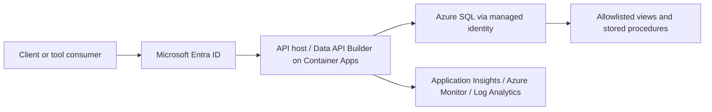
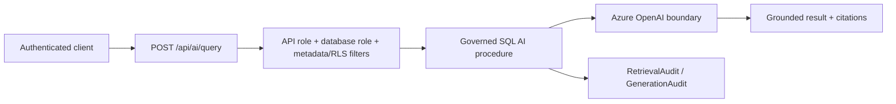

# Secure Application and API Integration

Milestone 14 exposes selected governed platform capabilities to applications and future AI/tool consumers through explicit allowlisted interfaces. It does not build a front end, generic chatbot, autonomous agent, Fabric implementation, or unrestricted database access path.

## Architecture

The standard flow is:

The AI flow is:

Trust boundaries are Entra token issuance, API ingress, managed identity to SQL, database role/procedure/view enforcement, outbound Azure OpenAI invocation, and telemetry/audit. Azure SQL is never directly internet-exposed to clients.

## Data API Builder

`src/api/dab/dab-config.production.json` exposes only selected entities:

- `ShipmentSummary`
- `ShipmentEvents`
- `RouteContext`
- `ServiceCaseSummary`
- `GroundingSourceReference`
- `AskGroundedOperationsQuestion`

Production DAB configuration uses Entra ID authentication, named roles, explicit permissions, field restrictions, no anonymous production permissions, REST for operational reads/actions, and GraphQL only for selected read entities.

## REST and GraphQL

REST covers shipment lookup, shipment events with filtering/pagination/safe sorting, route context, sanitized service-case summaries, grounding source metadata, and the thin AI query action. GraphQL is intentionally limited to selected read entities where field selection is useful.

Clients cannot submit arbitrary SQL, object names, unbounded filters, arbitrary URLs, shell commands, or destructive actions.

## Authentication and Authorization

The preferred pattern is:

client token -> API host -> managed identity / authorized SQL access -> database role.

Representative roles are `shipment_reader`, `operations_reader`, `customer_service_user`, `ai_query_user`, `ai_auditor`, `api_runtime_identity`, and `api_deployment_identity`. These align API permission, DAB permission, database role, row-level/metadata filter intent, and audit signals.

## AI Endpoint

`POST /api/ai/query` accepts a bounded question, optional shipment/account/route scope, `topK`, and correlation ID. The response contract includes a grounded answer, source references, evidence status, request ID, and error state.

Authorization propagates before retrieval. A caller must not receive AI context they could not access directly. Retrieved content is untrusted and cannot alter tool permissions, system policy, or authorization filters.

## MCP Boundary

The MCP-compatible boundary is a future tool-consumption contract, not an autonomous agent. Tools are read-focused and allowlisted: `get_shipment_status`, `get_shipment_history`, `get_route_context`, `search_operational_knowledge`, and `ask_grounded_operations_question`.

Every tool has strict input/output schemas, required roles, backing API/procedure mapping, sensitivity classification, and audit requirement.

## Hosting and Network

Azure Container Apps is the selected default for the containerized DAB/API runtime because it supports managed identity, controlled ingress, revisions, scaling, and Log Analytics integration. App Service remains a valid alternative if platform Easy Auth becomes the dominant requirement. Static Web Apps is deferred to any future front-end boundary. API Management is documented for future external consumers, central policy, versioning, analytics, and developer portal needs.

Production network posture uses private Azure SQL access, managed identity to SQL, TLS, private endpoint/DNS planning, controlled API ingress, and a governed outbound Azure OpenAI boundary.

## Resilience, Errors, Rate Limits

Reads are idempotent and may use bounded retry for transient failures. Generation/action endpoints avoid unsafe automatic replay after a request body is accepted. All endpoints have timeouts, request-size controls, page-size limits, consistent error classes, and rate-limit classes. AI endpoints receive stricter cost-aware controls.

## Observability and Audit

Application Insights, Azure Monitor, and Log Analytics capture request count, duration, failures, dependency duration, SQL failures, AI failures, authorization failures, throttling, and correlation IDs. Sensitive prompts, retrieved text, and source payloads are not logged indiscriminately.

Audit traceability follows identity -> API request -> database operation -> retrieval/generation audit where applicable -> response status.

## Validation Boundary

Local validation covers deterministic catalogs, DAB configuration structure, allowlist mappings, schema references, sensitive exposure decisions, security scenarios, and evidence consistency. DAB runtime execution, Entra token validation, managed identity to SQL, Container Apps deployment, Azure SQL procedure execution, and Azure OpenAI calls require Azure or application runtime validation.

