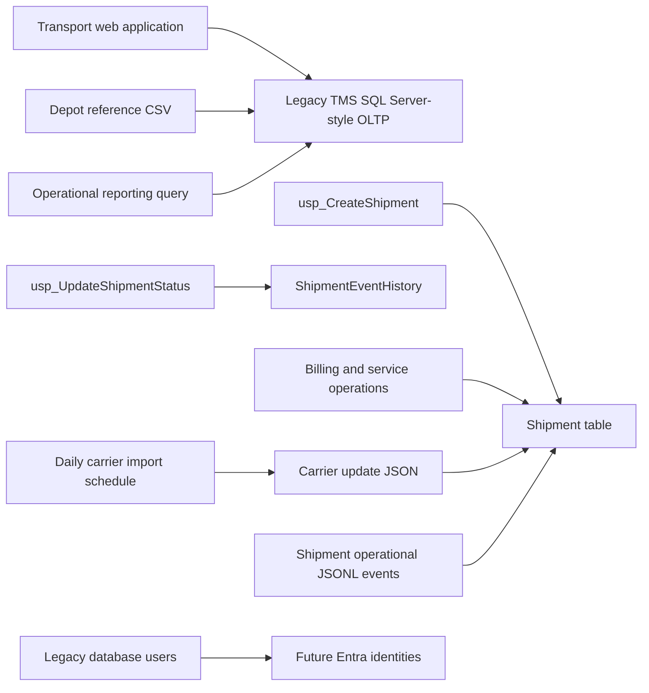

# Estate Assessment and Modernisation Decisioning

Milestone 3 adds a deterministic local assessment capability for the synthetic Contoso Freight estate. It uses repository metadata, static SQL analysis, source contracts, sample fixtures, and workload simulation output. It does not claim production telemetry, run Microsoft cloud assessment tools, deploy Azure resources, or perform migration.

## Assessment Outputs

Generated outputs are written by `make assess-estate`:

- `outputs/database_estate_inventory.csv`
- `outputs/estate_dependencies.csv`
- `outputs/compatibility_assessment.csv`
- `outputs/workload_classification.csv`
- `outputs/target_service_decisions.csv`
- `outputs/migration_complexity.csv`
- `outputs/migration_wave_plan.csv`
- `outputs/modernisation_risk_register.csv`
- `reports/estate_assessment_report.md`

## Evidence Classes

| Evidence class | Meaning |
| --- | --- |
| `locally measured` | Derived from local scripts, samples, contracts, or workload fixtures |
| `derived evidence` | Inferred from deterministic source metadata and assessment rules |
| `synthetic assumption` | Explicit assumption used to make the synthetic engagement realistic |
| `requires live estate validation` | Cannot be proven without a real source estate |

## Dependency Model

## Decision Framework

Target decisions consider compatibility, operational responsibility, scalability, performance, HA/DR, networking, security, migration complexity, application change, cost/licensing implications, cloud-native benefits, and future integration requirements.

The current recommendations are:

- `legacy_tms`: Azure SQL Managed Instance, replatform.
- `billing_ops`: Azure Database for PostgreSQL, replatform.
- `depot_partner_feeds`: Azure Databricks, refactor.
- `shipment_event_stream`: Azure Databricks, refactor.
- `operational_reporting`: Azure Databricks, refactor.
- `customer_service_search`: retain temporarily until governed data products and access controls exist.

Azure Cosmos DB is evaluated but not selected for current workloads because no Milestone 3 workload justifies document-database serving as the primary target. It may become relevant later for specific low-latency serving patterns, but that would require new evidence and an ADR.

## Scoring

Migration complexity is scored from 1 to 5 using configurable weights in `src/estate_assessment/rules.py`:

- schema complexity
- feature compatibility
- application coupling
- data volume
- downtime tolerance
- integration count
- security complexity
- operational criticality
- performance sensitivity

The weighted total maps to:

- low: below 2.6
- medium: 2.6 to below 3.8
- high: 3.8 and above

## Migration Sequencing

- Wave 0: prerequisites and remediation.
- Wave 1: low-risk feeds and analytical offload foundations.
- Wave 2: secondary relational source.
- Wave 3: business-critical transport OLTP.

The sequencing intentionally moves dependency reduction and reporting offload ahead of the core transport OLTP migration.

