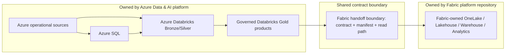

# Microsoft Fabric Downstream Integration Boundary

Milestone 15 defines the downstream contract between this Azure Data & AI platform and the separate `enterprise-microsoft-fabric-adoption-platform` repository. This repository remains the Azure-side producer. It does not implement Fabric workspaces, OneLake assets, Lakehouses, Warehouses, semantic models, Power BI reports, Fabric pipelines, notebooks, Real-Time Intelligence, or Fabric deployment pipelines.

## Ownership

Azure Data & AI platform owns operational database sources, Azure SQL, Databricks ingestion, Bronze/Silver/Gold engineering, data quality, source-to-Gold lineage, Gold contracts, API/AI services, Azure-side security, and publication readiness.

Fabric platform owns downstream ingestion/shortcut/mirroring decisions after handoff, OneLake, Fabric Lakehouse/Warehouse implementation, semantic modelling, Power BI, Fabric-side RLS/OLS, Fabric monitoring, Fabric adoption/governance, and Fabric CI/CD.

Shared responsibilities are limited to data contracts, identity groups, sensitivity metadata, SLA/freshness expectations, lineage handoff identifiers, and incident coordination.

## Fabric-Facing Products

Only governed Gold or curated aggregate products are eligible by default:

- `gold.shipment_operations_performance`
- `gold.depot_route_performance`
- `gold.delivery_delay_metrics`
- `gold.billing_revenue_summary`
- `gold.service_incident_summary`

Bronze and Silver are not exposed by default because that would duplicate transformation ownership and weaken the producer/consumer boundary.

## Integration Patterns

The preferred pattern is governed Databricks Gold Delta published through an ADLS/Delta boundary and consumed in Fabric through OneLake shortcuts or a supported interoperability path after runtime validation. This minimizes data duplication and keeps Gold logic authoritative in Azure.

Controlled batch copy is an exception for finance snapshot, retention, or audit requirements. API-based access is reserved for operational/API use cases and is not the default analytical handoff. Mirroring is evaluated only where the source and business requirement match supported Fabric capabilities; it is not used to move ownership of Azure Gold transformations.

## Contracts and Versioning

Every Fabric-facing product has a machine-readable contract covering dataset, schema version, field, type, nullability, key, semantic meaning, sensitivity, allowed consumer class, freshness expectation, quality expectation, and lifecycle.

Schema evolution policy:

- Additive nullable fields are backward compatible.
- Non-nullable additions require review.
- Renames, removals, type changes, grain changes, and key semantic changes are breaking.
- Breaking changes require a major version or new product ID, consumer notification, and a migration period.

## Publication Gate

A product can be published only when the upstream pipeline succeeded, critical quality checks passed, the schema contract is valid, freshness is inside the expected boundary, sensitivity metadata is present, and publication status is ready. Existing Databricks quality/orchestration evidence remains the source for producer-side gate status.

## Freshness and SLA Handoff

The Azure producer owns freshness until Gold publication and manifest handoff. Fabric owns downstream shortcut/ingestion/model refresh and consumer-facing analytics freshness after the handoff. These are producer and consumer responsibilities, not a fabricated customer SLA.

## Identity and Storage

Identity handoff uses Entra groups, service principals, or managed identities. Storage account keys and SAS are not preferred. Fabric receives read-only access only to published Gold product paths, with RBAC and ACL boundaries where appropriate. Bronze, Silver, quarantine, operational databases, AI internal context tables, and audit internals are not exposed by default.

## Sensitivity and Lineage

Sensitivity metadata such as operational, confidential, financial, and restricted service-case classifications is included in the contract. Fabric must enforce downstream workspace access, RLS/OLS where applicable, labels, and audit controls. Automatic metadata propagation is not claimed until validated in Fabric.

Azure-side lineage ends at the published Gold product and handoff manifest. Fabric-side lineage begins at the shortcut, ingestion, or downstream consumption object. Handoff identifiers correlate the two sides without fabricating a single cross-platform lineage graph.

## Quality, Failure, and Cost

Each product publishes a compact quality manifest with publication timestamp, schema version, record count, quality status, freshness status, critical rule failures, and source processing ID. Large internal quality logs remain inside the producer platform.

Failure ownership is explicit: Azure owns Gold availability, producer quality, and publication readiness. Fabric owns downstream shortcut, model, report, and Fabric processing failures. Shared failures include schema incompatibility, freshness coordination, and identity/RBAC issues.

Cost controls prefer no-copy shortcuts/interoperability, avoid unnecessary duplicate transformations, restrict copy patterns to justified cases, align regions where possible, and maintain version lifecycle so duplicate versions are not retained indefinitely.

