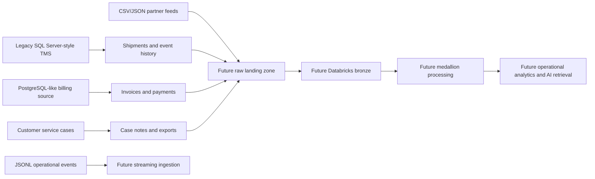

# Synthetic Legacy Data Estate

Milestone 2 implements a reproducible, public-safe source estate for the Contoso Freight scenario. It is designed for later assessment, migration, ingestion, quality, governance, performance, and AI milestones. It does not deploy Azure resources or implement downstream modernisation.

## Source Systems

| Source | Local representation | Ownership | Purpose |
| --- | --- | --- | --- |
| Legacy transport management system | SQL Server-style scripts in `src/azure_sql/legacy_oltp/sqlserver/` and generated CSV tables | Transport operations | Customers, depots, routes, vehicles, shipments, shipment event history |
| Billing and service operations | PostgreSQL-like schema in `src/data_engineering/secondary_sources/postgres_billing/schema.sql` and generated CSV extracts | Finance and customer service | Invoices, payments, service cases, case notes |
| File-based partner feeds | CSV/JSON fixtures under generated `file_feeds/` folders | Depot operations and carrier integrations | Depot references, carrier status updates, customer-service exports |
| Event-style fixtures | JSONL records under generated `events/` folders | Transport platform integration | Shipment operational events for future streaming and CDC-like processing |

Committed tiny samples live under `data/samples/legacy_estate/tiny/`. Regenerated development or performance datasets should be written to ignored paths under `data/raw/legacy_estate/`.

## Source-System Flow



## Domains and Relationships

The estate uses one integrated domain:

- Customers place freight orders and own service-tier commitments.
- Shipments move across routes between depots and can be assigned vehicles.
- Shipment event history records operational status changes.
- Invoices and payments reference shipments but use a different customer identifier style.
- Customer-service cases reference customers and shipments and include synthetic case notes.
- Carrier and depot feeds provide file-based operational updates with controlled drift.

## Synthetic Data Profiles

| Profile | Purpose | Approximate size |
| --- | --- | --- |
| `tiny` | Fast tests and committed sample review | 8 customers, 18 shipments, 74 operational events |
| `development` | Local development and exploratory validation | 120 customers, 1,000 shipments, about 5,000 operational events |
| `performance` | Larger local performance and query-pattern testing | 2,000 customers, 50,000 shipments, about 300,000 operational events |

Generate data with:

```bash
python3 -m legacy_estate.generator --profile development --output-dir data/raw/legacy_estate
```

Generate workload operations with:

```bash
python3 -m legacy_estate.workload --operations 250 --output-path data/raw/legacy_estate/workload.jsonl
```

Both commands support `--seed` for deterministic regeneration.

## Intentional Data-Quality Issues

The default generator injects traceable defects while keeping the core relational model usable:

- Duplicate customer account numbers with variant legal names.
- Null depot capacity in a file feed.
- Malformed service-case email.
- Service case referencing an unknown shipment identifier.
- Duplicate event delivery.
- Out-of-order and late-arriving events.
- Carrier feed schema drift with `schema_version` 2 and an extra ETA field.
- Inconsistent customer identifiers across OLTP and billing extracts.

The generated `data_quality_issues.json` file documents each injected issue.

## Legacy Characteristics and Technical Debt

The SQL Server-style estate deliberately includes credible modernisation pain points:

- `datetime`, `money`, `ntext`, `rowversion`, and `nvarchar(max)` JSON payload usage.
- Stored procedure dependencies for shipment creation and status updates.
- Operational reporting views and queries competing with OLTP tables.
- History/event table growth pattern.
- Missing covering index for route/depot/status reporting.
- Cross-source identifier mismatch between `CUST` and `ACCT` styles.
- File and event feeds that can drift independently of relational schemas.

## Workload Profiles

The workload simulator emits deterministic JSONL operations covering:

- OLTP: customer lookup, shipment creation, shipment status updates, invoice lookup, incident/case creation.
- Operational reporting: route and depot workload summaries.
- Candidate analytical workload: delay reporting suitable for future lakehouse processing.
- CDC/event candidates: shipment creation, shipment status updates, and case creation.

## Future Relevance

Later milestones can use this estate for:

- Azure SQL migration assessment and compatibility analysis.
- Database project, schema drift, and CI/CD design.
- Query tuning, indexing, and HA/DR exercises.
- CDC, Auto Loader, Structured Streaming, and Lakeflow ingestion.
- Medallion modelling and data quality remediation.
- PII classification, masking, lineage, and governance.
- Vector/hybrid search and grounded RAG over shipments, cases, and operational knowledge.

