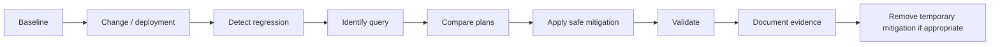

# SQL Performance Engineering

Milestone 7 adds a reproducible SQL performance-engineering capability for `legacy_tms` on Azure SQL Managed Instance. It does not collect Azure telemetry, execute workloads on SQL MI, or fabricate execution-plan XML. Milestone 8 integrates the regression model into SQL CI/CD release evidence.

## Scope

Covered:

- Performance baseline model.
- Workload catalog.
- Query Store configuration and diagnostics.
- DMV diagnostic toolkit.
- Static execution-plan analysis model.
- Focused index engineering.
- Statistics strategy.
- Blocking and deadlock diagnostics.
- Isolation/concurrency evaluation.
- Parameter-sensitive query scenario.
- Regression workflow.
- Deterministic performance assurance evidence.

Deferred:

- Real SQL MI execution.
- Production Query Store runtime analysis.
- Actual execution-plan capture.
- Live SQL MI performance gate execution.
- Broad index/query tuning campaign.

## Evidence Boundary

| Evidence type | Meaning |
| --- | --- |
| locally validated | Repository assets and deterministic outputs are present and internally consistent |
| static analysis | Based on SQL shape and schema without executing on SQL MI |
| simulated | Deterministic representative metrics or scenarios |
| derived | Inferred from prior milestones and workload model |
| requires Azure validation | Requires real SQL MI/Azure SQL execution and telemetry |

## Workload Baseline

The workload catalog and baseline are generated under `outputs/sql_performance/`.

Baseline categories:

- customer lookup
- shipment creation/update
- shipment status query
- route/depot operational reporting
- incident/case lookup
- analytical delay/reporting query

Baseline metrics are simulated/derived and must be replaced or calibrated with Query Store and DMV evidence in a real SQL MI environment.

## Query Store

Assets in `src/azure_sql/performance/query_store/` cover:

- enabling and configuring Query Store
- capture mode
- storage limits
- cleanup
- wait stats
- top resource consumers
- regressed queries
- plan history
- forced plans
- Query Store hints
- safe removal of forced plans/hints

## Execution Plan Analysis

The static analysis model covers:

- scans vs seeks
- key lookups
- join choices
- cardinality-estimate risks
- stale statistics
- memory grant/spill indicators
- implicit conversions
- missing indexes
- sort/hash warnings
- estimated vs actual row count differences

No XML plans are fabricated.

## Index Engineering

The focused before/after scenario is the route/depot reporting pain point. The target schema contains `IX_Shipment_Route_Status_CreatedAt`; Milestone 7 models why it exists, how to validate it, and what write overhead to watch.

Additional recommendations remain candidates until Query Store and index usage evidence justify them. The milestone avoids indexing every predicate or adding speculative indexes to every table.

## Statistics Strategy

The strategy:

- keeps automatic statistics enabled
- detects stale statistics through metadata
- uses targeted `UPDATE STATISTICS`
- reserves `FULLSCAN` for narrow evidence-backed cases
- aligns with Milestone 6 SQL Agent automation

Blanket `FULLSCAN` and blanket index rebuilds are avoided.

## Blocking, Deadlocks and Concurrency

The toolkit includes DMV scripts, simulated blocking scenarios, an Extended Events deadlock capture definition, a deterministic repro pattern, and application retry guidance for error 1205.

The recommended isolation posture is compatibility-first:

- keep READ COMMITTED as migration baseline
- evaluate RCSI if reader/writer blocking is material
- use SNAPSHOT selectively
- reserve SERIALIZABLE for strict range-protection workflows
- validate optimized locking availability before relying on it

## Regression Workflow

The workflow now maps into the Milestone 8 SQL CI/CD evidence model, while live Query Store comparison still requires an Azure SQL Managed Instance environment.
