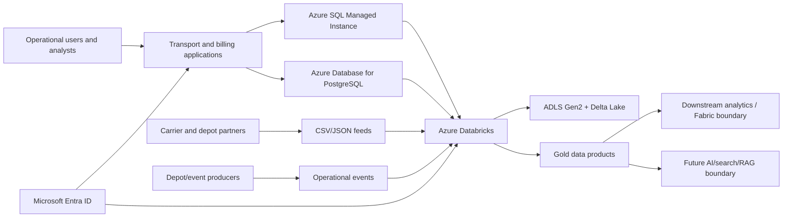
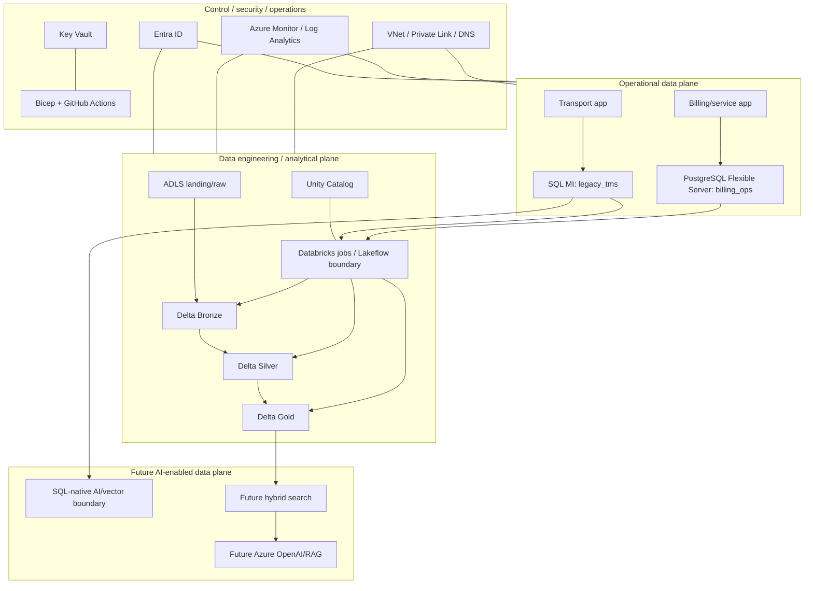
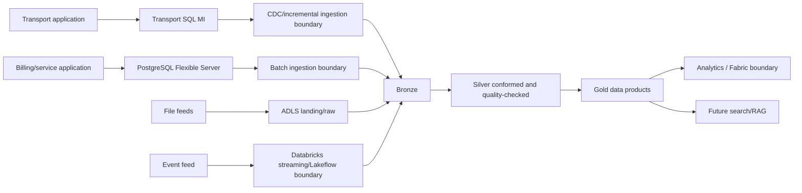
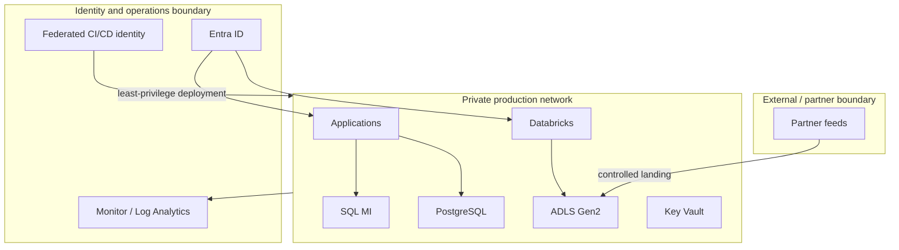

# Target-State Architecture

Milestone 4 formalises the target-state architecture required before implementation. It validates the Milestone 3 recommendations into an implementation-ready design pack, while keeping migration, Databricks workloads, AI search/RAG, and production deployment deferred.

## Architecture Planes

### Operational Data Plane

- Azure SQL Managed Instance is the initial target for `legacy_tms`, subject to live validation of instance features, collation, SQL Agent-style jobs, cross-database assumptions, storage, and performance telemetry.
- Azure Database for PostgreSQL Flexible Server is the target for `billing_ops`, preserving PostgreSQL-like relational semantics.
- Applications connect through private endpoints/private network paths in production.
- Transactional ownership remains with operational application teams; analytical products consume governed replicated/ingested data rather than querying OLTP directly.

### Data Engineering / Analytical Plane

- ADLS Gen2 provides landing/raw, bronze, silver, gold, checkpoint, schema metadata, quarantine, and audit/evidence zones.
- Azure Databricks provides batch, CDC/incremental, streaming/event ingestion, data quality, medallion processing, and analytical workload offload.
- Delta Lake is the storage format for medallion tables.
- Unity Catalog owns lakehouse catalog/schema/table permissions, lineage, and managed/external table boundaries.
- Fabric is a downstream integration boundary only, not a duplicated platform implementation in this repository.

### AI-Enabled Data Plane

The AI plane is a future boundary only:

- Azure SQL native vector/AI capabilities may support close-to-operational-data use cases.
- Embeddings, full-text/vector/hybrid search, Azure OpenAI, grounded RAG, and secure REST/GraphQL/MCP integration remain future implementation work.
- No AI search index, RAG service, or model integration is implemented in Milestone 4.

### Control / Security / Operations Plane

- Microsoft Entra ID is the human and workload identity root.
- Managed identities and federated CI/CD identity are preferred.
- Key Vault stores unavoidable secrets and optional future customer-managed keys.
- Private Link, private endpoints, Private DNS, segmented VNets, RBAC, Azure Monitor, Log Analytics, Application Insights, auditing, Defender posture, Bicep, GitHub Actions, policy, and cost controls form the production control plane.

## System Context

## Target Logical Architecture

## Major Data Flows

## Trust and Security Boundaries

## Azure SQL Managed Instance Decision

SQL MI remains the initial target for `legacy_tms` because:

- The source is SQL Server-style with stored procedures and compatibility concerns.
- SQL Agent-style and instance-level requirements are not yet live-validated.
- Downtime tolerance and operational criticality are tight enough to favour compatibility-first migration.
- Private networking is a production requirement and aligns with MI deployment patterns.
- Backup behaviour, PITR, HA, and future failover-group options support the transport workload's assumed recovery tier.

The decision would move toward Azure SQL Database if live discovery proves no instance-level dependencies, no cross-database needs, low procedure coupling, acceptable collation/compatibility, and a stronger need for database-scoped platform simplification. It would move toward SQL Server on Azure VM only if unsupported OS/instance dependencies are found and cannot be remediated.

Sizing, service tier, storage, compute, IO, maintenance windows, backup retention, and cost require live validation. No exact production sizing is claimed.

## PostgreSQL Target Design

Azure Database for PostgreSQL Flexible Server is the target for `billing_ops`:

- Flexible-server style deployment is assumed.
- Production should use private access, Entra-compatible access patterns where supported, Key Vault for unavoidable credentials, and restricted admin paths.
- HA, storage autoscale, backup retention, maintenance windows, and geo-recovery require live workload validation.
- Application connection changes should be isolated through configuration and tested with billing reconciliation.

Migration into Azure SQL is not preferred because the workload is PostgreSQL-like and no evidence currently justifies engine conversion.

## Databricks and Storage Design

Databricks responsibilities:

- Workspace boundaries by environment.
- Unity Catalog catalogs such as `cf_dev`, `cf_test`, and `cf_prod`, with schemas aligned to `bronze`, `silver`, `gold`, `audit`, and governed domains.
- Job compute for production jobs; interactive compute for development. Serverless/classic selection remains a design assumption pending region, policy, and workload validation.
- External tables for ADLS-governed zones unless managed tables are specifically justified by lifecycle ownership.
- Batch ingestion for source extracts, CDC/incremental ingestion for operational databases, streaming ingestion for event fixtures, and Lakeflow as the future orchestration boundary.

ADLS Gen2 zones:

- `landing/raw`
- `bronze`
- `silver`
- `gold`
- `checkpoints`
- `schemas`
- `quarantine`
- `audit-evidence`

Lifecycle policies, encryption, environment separation, and access boundaries are future implementation tasks.

## Networking

Production target architecture:

- Segmented VNet/subnets for databases, private endpoints, Databricks connectivity, and administration.
- SQL MI deployed into its required delegated subnet.
- PostgreSQL, ADLS, Key Vault, and monitoring ingestion use private access where supported.
- Private DNS zones are required for private endpoint name resolution.
- Administrative access should use controlled jump, VPN, bastion, or privileged access paths.
- Egress should be restricted and observable.

Portfolio/dev simplification:

- Local generation and validation remain possible without Azure networking.
- Dev deployments may simplify connectivity only when explicitly documented and isolated from production assumptions.

## Identity and Authorization

Representative least-privilege personas:

| Persona | Target access |
| --- | --- |
| Platform administrator | Deploy and manage platform resources through approved IaC |
| Database administrator | Database operations, performance, backup/restore, no broad data export by default |
| Data engineer | Databricks jobs, controlled ADLS zones, Unity Catalog grants |
| Application workload | Managed identity access to its database and required secrets only |
| Security/auditor | Read audit logs, configuration, access evidence, and security posture |
| CI/CD deployment identity | Federated deployment rights scoped to environment and capability |
| Read-only operational analyst | Gold/serving data only, no raw sensitive data by default |

No real users are hardcoded.

## Data Protection

Target controls:

- Encryption at rest for SQL MI, PostgreSQL, ADLS, Databricks-managed data paths, and Key Vault.
- TLS in transit.
- SQL TDE and database auditing.
- Customer-managed keys only if live policy requires them.
- Dynamic Data Masking and Row-Level Security where business rules require.
- Sensitive data classification and audit retention.
- Key Vault for unavoidable secrets.
- Synthetic portfolio-data constraint remains in this repository.

Implementation of these controls is deferred to later security, IaC, database, and Databricks milestones.

## HA/DR Strategy

| Tier | RTO | RPO | Strategy |
| --- | --- | --- | --- |
| Critical transport OLTP | 60 minutes | 15 minutes | SQL MI built-in HA, backup/PITR, later failover-group or geo-restore design |
| Billing/service | 240 minutes | 60 minutes | PostgreSQL Flexible Server HA where justified, automated backups, geo-recovery planning |
| Analytical processing | 480 minutes | 240 minutes | Replayable ingestion, restartable Databricks jobs, resilient storage |
| Non-critical feeds | 1440 minutes | 480 minutes | Raw retention, resend/replay, quarantine |

DR is not tested in Milestone 4.

## Cost and Sizing Assumptions

No exact monthly bill is calculated. Key drivers are:

- SQL MI vCores, storage, IO, backup retention, HA/DR replicas, and licensing model.
- PostgreSQL compute, storage growth, HA, backups, and connection/concurrency profile.
- Databricks job compute, streaming uptime, cluster policy, serverless/classic mode, Photon suitability, and concurrency.
- ADLS storage tiers, transactions, lifecycle, checkpoint and quarantine retention.
- Log Analytics ingestion and retention.
- Future AI token, embedding, vector/hybrid search, and API usage.

Assumptions are machine-readable in `outputs/architecture/assumption_register.csv`.

